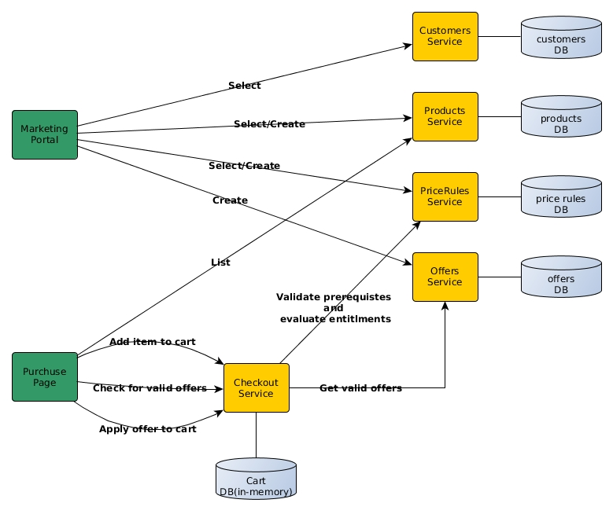

# Seek Assessment 

## TO DO

* Add more specs to cover more use cases
* Seed some data for testing purposes so each service spec becomes independent 
* Compile services logic in a gem 
* Encapsulate each service in a separate containerized application
* Each service exposed via HTTP interfaces
* Each service has it's own DB
* I used SQLite for testing purposes and portability but it's better to be changed to postges
* Use Redis for Cart Services
* Write simple React app to consume those services

## How to run the test code using Docker

```bash
docker build -t abdul-razzak-seek-assessment .
docker run abdul-razzak-seek-assessment

```

## Solution Design


 


## Price Rule Model

(Inspired from Shopify)

#### value_type 

Value type of the price rule. 

Valid values:
* **freebies**: Applies a value of free items. For example, if value is 1, then 1 of the entitled items prices is deducted (lowest price one). 
* **fixed_percentage_discount**: Applies a percentage discount of value. For example, if value is 30, then 30% will be deducted when the discount is applied.
* **fixed_amount_discount**: Applies a discount of value. For example, if value is 30, then $30 is deducted when the discount is applied.
* **fixed_price**: Set value as a new price for the product. For example, if value is 30, then $30 is charged when the discount is applied.

#### value

Value of the price rule which related to value_type.

#### target_selection

Target selection method of the price rule. 

Valid values:
* **all**: The price rule applies the discount to all items in the cart.
* **entitled**: The price rule applies the discount to specfied products only. releated to entitled_products_skus param.

#### allocation_method

Allocation method of the price rule. 

Valid values:
* **each**: The discount will be applied to each of the entitled items(entitled_products_skus). For example, for a price rule that take $15 off, each entitled item in the cart will be discounted by $15.
* **across**: The calculated discount amount will be applied across all items total. For example, for a price rule that takes $15 off, the discount will be applied for the whole bill amount.

#### prerequisite_minimum_items

Value that establishes the floor for prerequisite number of items that has to be in the cart.

#### prerequisite_minimum_subtotal

Value that establishes the floor for prerequisite subtotal of the cart. The subtotal of the entitled cart items must be greater than or equal to this value for the discount to apply.

#### entitled_products_skus	
List of product skus that will be applicable for the discount. The entitled_product_ids can be used only with target_selection set to entitled. otherwise will be ignored.